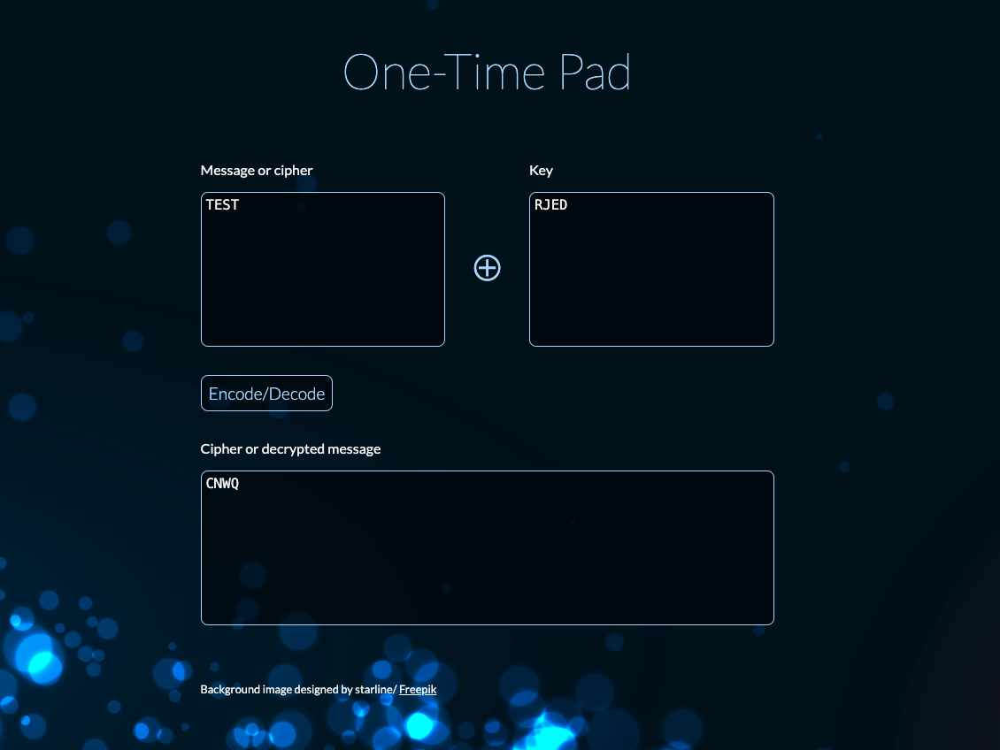

JS-One-Time-Pad
===============

A simple one-time pad class built in Javascript, cleaned up
from my 2014 version.

Since there are 26 letters in the English alphabet, the encoder
needs to support at least 5 bits to represent each character.
The remaining 6 characters are set to commonly used characters,
and the ? is used as a catch-all for unsupported characters.

```js
// Supported characters and their mapped values:
{
  0: 'A', 1: 'B', 2: 'C', 3: 'D', 4: 'E', 5: 'F', 6: 'G', 7: 'H',
  8: 'I', 9: 'J', 10: 'K', 11: 'L', 12: 'M', 13: 'N', 14: 'O',
  15: 'P', 16: 'Q', 17: 'R', 18: 'S', 19: 'T', 20: 'U', 21: 'V',
  22: 'W', 23: 'X', 24: 'Y', 25: 'Z', 26: '.', 27: ' ', 28: ',',
  29: '\'', 30: '-', 31: '?'
}
```

## Demo

See live demo [here](http://ikcede.github.io/JS-One-Time-Pad/).

